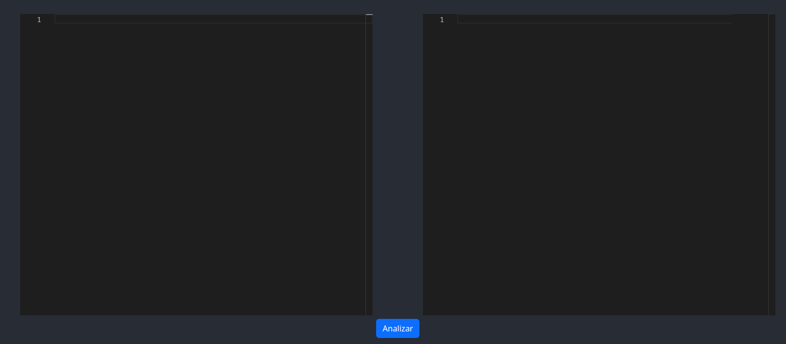
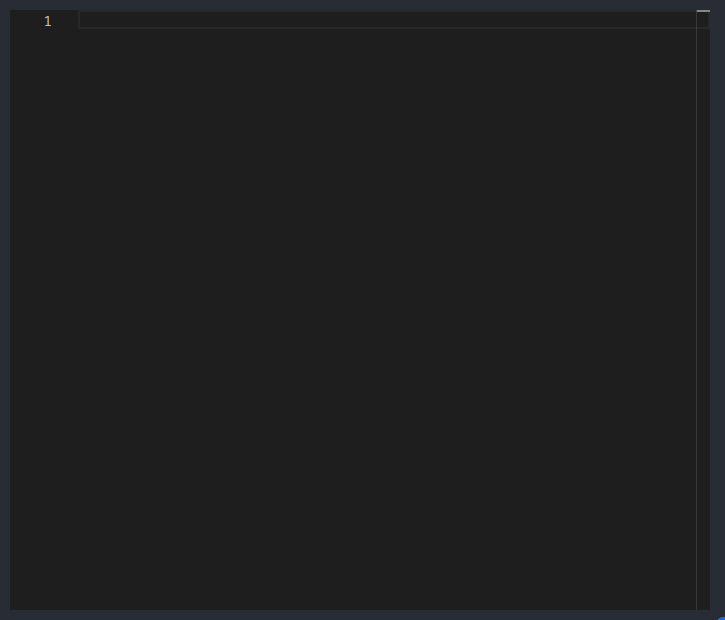
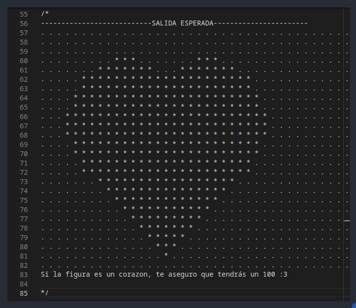
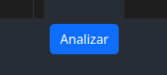

# Manual de Usuario
### Pantalla de inicio
El manual de usuario muestra el uso que se le puede dar al programa. Empezamos explicando la funcionalidad de la pantalla de inicio:

Esta pantalla nos muestra la caja de texto a la izquierda para poder escribir el codigo que se ejecutará más adelante.

### Caja de texto
En esta caja podremos incluir todo el texto y nos mostrará la linea en la cual esta el cursor y tambien el tamaño de las líneas en las cuales se encuentra cada token, declaración etc.

Luego vemos la caja de texto con el código ingresado.

### Botón Analizar

Este boton nos permitirá analizar el texto que introduzcamos en la caja de la izquierda y saldrá el resultado del análisis del código ingresado como salida.

Luego también tenemos la opción de generar un AST el cual es un gráfico que muestra un arbol con cada una de las producciones de la gramática.